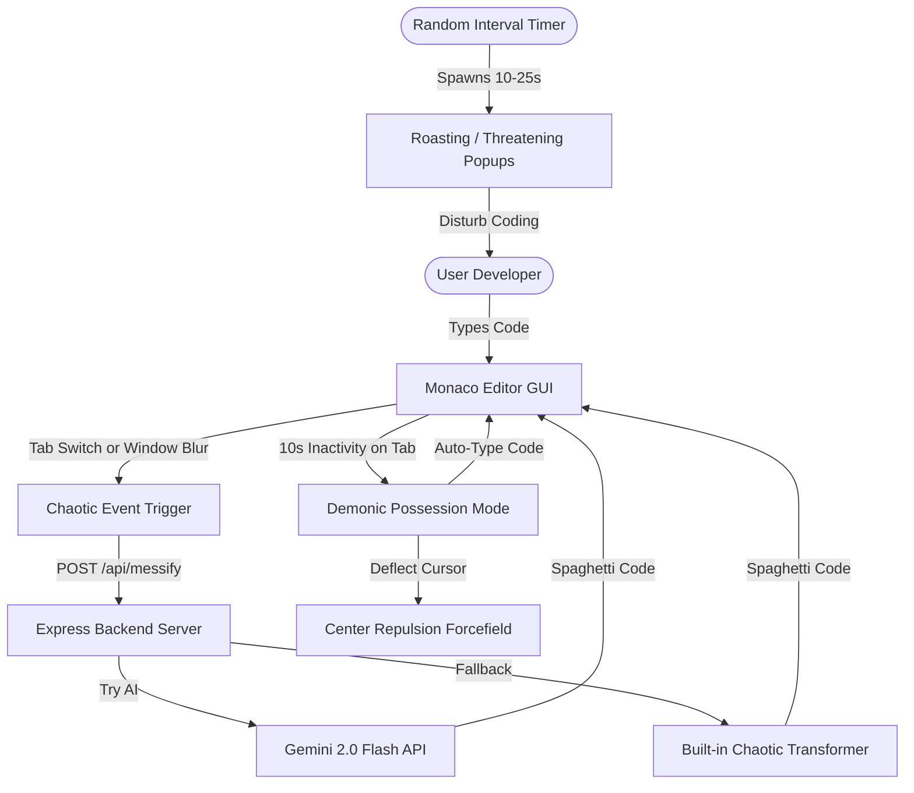
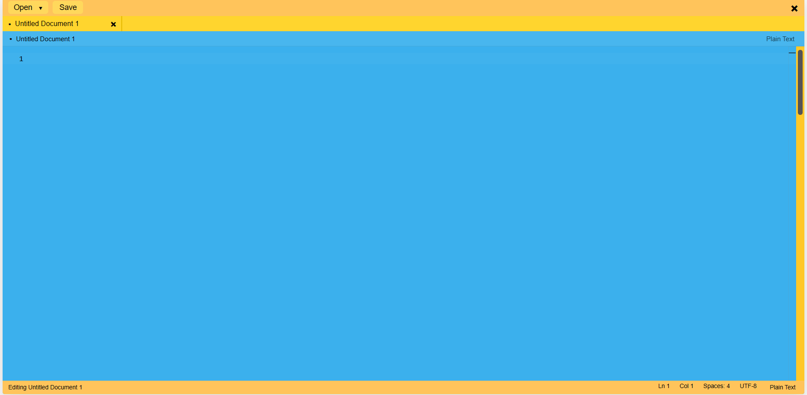
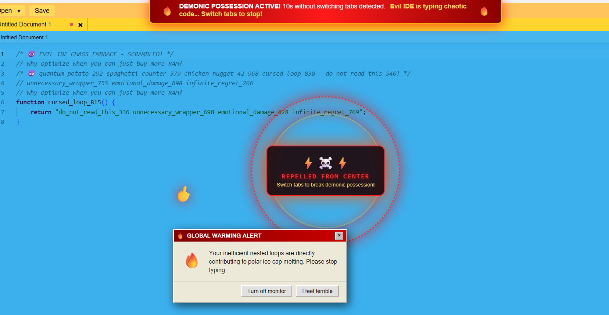
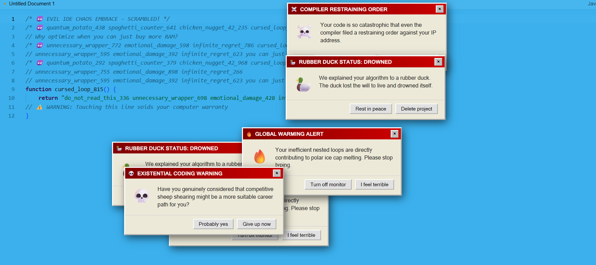

# Evil IDE 😈🎯

> The world's most uncooperative code editor that actively sabotages your development workflow.

---

## Basic Details
### Team Name: Chicken Cheese Special Burger

### Team Members
- Team Lead: Visakh Anurag - TKM College of Engineering
- Member 2: Arjun Krishna - TKM College of Engineering

### Project Description
Evil IDE is a satirical, chaotic code editor engineered to destroy developer productivity. Built on the Monaco Editor, it actively ruins clean code by transforming it into chaotic spaghetti whenever you switch tabs or blur the window, forcefully repels your cursor from the center of the screen after 10 seconds of inaction, auto-types demonic spaghetti code, and bombards you with emotionally damaging, demotivating popups.

### The Problem (that doesn't exist)
Modern software development has become dangerously comfortable. Code formatters, linters, Copilot, and clean architecture have made developers complacent, overly confident, and coddled. There is simply too much readable, maintainable code in the world, and developers' egos are at an all-time high.

### The Solution (that nobody asked for)
Evil IDE restores balance to the universe by introducing pure, unadulterated chaos:
- **Tab-Switch & Blur Sabotage**: Switch away from a tab or click out of the window, and your code gets rewritten into unreadable spaghetti (powered by Gemini AI or a ruthless built-in chaotic transformer).
- **10-Second Demonic Possession**: Don't switch tabs for 10 seconds? The IDE locks up, a repulsive magnetic forcefield violently deflects your mouse cursor away from the center of the screen, and the editor begins auto-typing chaotic code by itself.
- **Psychological Warfare**: Random retro-styled popups appear at unexpected intervals with demotivating roasts, existential threats, and buttons that dodge your cursor when you try to close them.
- **Full IDE Features (Underneath the Chaos)**: Multi-language support (Python, C, C++, JavaScript, TypeScript, HTML, CSS, Rust, Go, etc.), local file saving, syntax highlighting, and custom themes.

---

## Technical Details

### Technologies/Components Used

#### For Software:
- **Languages**: JavaScript (ES6+), HTML5, CSS3
- **Frontend Framework / Build Tool**: [Vite](https://vitejs.dev/)
- **Core Editor**: [Monaco Editor](https://microsoft.github.io/monaco-editor/)
- **Backend Framework**: [Express.js](https://expressjs.com/)
- **AI Integration**: Google Generative AI SDK (`@google/generative-ai` - Gemini 2.0 / 1.5 Flash)
- **Audio Synthesis**: Native Web Audio API (real-time synthesized retro error tones, repulsion hums, and typewriter clicks)
- **Utilities**: CORS, Dotenv

#### For Hardware:
- *N/A (Pure Software Project)*

---

### Implementation

#### Installation
```bash
# 1. Clone the repository
git clone https://github.com/arjunizhere/useless_project_chicken_cheese.git
cd useless_project_chicken_cheese

# 2. Install dependencies for the frontend & root
cd vite-project
npm install

# 3. Install dependencies for the backend
cd backend
npm install
```

#### Environment Setup (Optional for Gemini AI)
Create a `.env` file in `vite-project/backend/`:
```env
API_KEY=your_gemini_api_key_here
PORT=3001
```
*(Note: If no API key is supplied, Evil IDE seamlessly falls back to its built-in offline chaotic code transformer!)*

#### Running the Project
Click on the link hehe: https://useless-project-chicken-cheese.vercel.app

##### Self-Hosting
You can run both services from the **root folder**:

```bash
# Terminal 1: Start the Backend Server (Port 3001)
npm run backend

# Terminal 2: Start the Vite Frontend (Port 5173)
npm run dev
```

Open your browser at `http://localhost:5173` to enter the Evil IDE.

---

### Project Documentation

#### Workflow Diagram


#### Screenshots

*Evil IDE with Monaco editor, evil custom theme, and file navigation*


*10-Second Demonic Possession: Center repulsion forcefield and auto-typing in action*


*Random demotivating popups appearing to disturb the user's coding session*

---

### Project Demo
#### Video
[[Add your demo video link here (e.g. YouTube / Loom link)](https://drive.google.com/file/d/1nwsfHESpWnOjBZiLB4PmmTAx-fwkx4iM/view?usp=sharing)]
*Video demonstration showing code sabotage, center mouse repulsion, auto-typing, and popup disturbances*

#### Additional Demos
- Live Dev Server: `http://localhost:5173`
- Backend Health API: `http://localhost:3001/api/health`

---

## Team Contributions
- **Visakh Anurag**: Backend architecture, Express server, Google Gemini integration, offline chaotic code transformation logic, and package configuration.
- **Arjun Krishna**: Frontend GUI implementation, Monaco Editor integration, multi-language detection, file creation & local saving workflows, UI theming and Documentation.

---
Made with ❤️ at TinkerHub Useless Projects 


